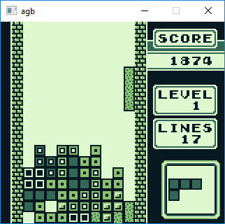
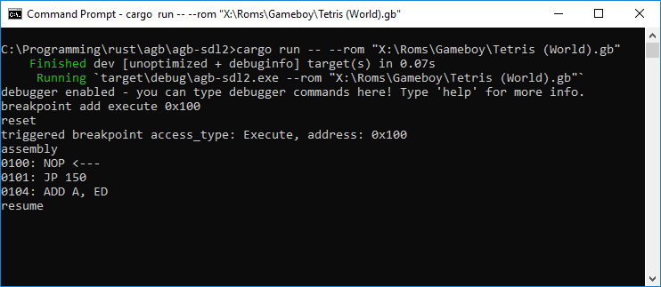
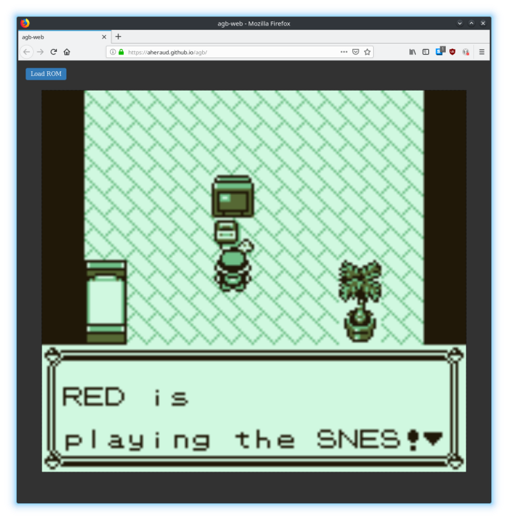

# agb

A GameBoy emulator written in rust.

## Subprojects

### agb-sdl2

Simple cross-platform emulator frontend using SDL2.

Has a simple command line debugger (no debugger gui, yet).

### agb-web

Run the emulator in a browser using web assembly!

## TODO

    1. dmg ppu timings
    2. graphical debugger
    3. test what happens to lcd stat when you disable the lcd on a dmg (what mode does lcd stat report etc)
    4. fix oam dma (don't do it all at once)
    5. fix some graphical bugs in dmg mode
    6. add sound
    7. cgb double speed mode
    8. cgb ppu implementation
	9. better support for save ram (example: saving/loading RTC registers for MBC5)
